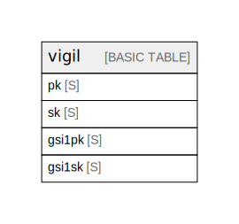

# Amazon DynamoDB (ap-northeast-1)

## Tables

| Name              | Attributes | Comment                                                                                                                                                                                                                                                                                                                                                                                                            | Type        |
| ----------------- | ---------- | ------------------------------------------------------------------------------------------------------------------------------------------------------------------------------------------------------------------------------------------------------------------------------------------------------------------------------------------------------------------------------------------------------------------ | ----------- |
| [vigil](vigil.md) | 4          | Single-table design with GSI 1. 7 logical entities (User Profile / Session / Domain / Domain WHOIS / SSL / DNS / Alert) are stored under different PK/SK prefixes. TTL on `ttl` attribute (Unix timestamp) for session expiry. GSI 1 (gsi1pk/gsi1sk) is reserved for Phase 2 features (cross-user queries). See ../entities.md and ../access-patterns.md for full attribute definitions.  | BASIC TABLE |

## Relations

---

> Generated by [tbls](https://github.com/k1LoW/tbls)
