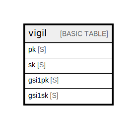

# vigil

## Description

Single-table design with GSI 1. 7 logical entities (User Profile / Session / Domain /  
Domain WHOIS / SSL / DNS / Alert) are stored under different PK/SK prefixes.  
TTL on `ttl` attribute (Unix timestamp) for session expiry. GSI 1 (gsi1pk/gsi1sk) is  
reserved for Phase 2 features (cross-user queries). See ../entities.md and  
../access-patterns.md for full attribute definitions.  

## Attributes

| Name   | Type | Default | Nullable | Children | Parents | Comment                                                                                                                                                                                                                                                                                                                                                                                                                                                                                                                                                        |
| ------ | ---- | ------- | -------- | -------- | ------- | -------------------------------------------------------------------------------------------------------------------------------------------------------------------------------------------------------------------------------------------------------------------------------------------------------------------------------------------------------------------------------------------------------------------------------------------------------------------------------------------------------------------------------------------------------------- |
| pk     | S    |         | false    |          |         | Partition key. Prefix determines the entity scope:   USER#{userId}        User-scoped data (Profile / Domain / Domain sub-rows)   SESSION#{sessionId}  Session metadata (TTL deletion)                                                                                                                                                                                                                                                                                                                                                          |
| sk     | S    |         | false    |          |         | Sort key. Prefix determines the entity type:   PROFILE                                User profile (single per user)   META                                   Session metadata   DOMAIN#{hostname}                      Domain (parent row)   DOMAIN#{hostname}#WHOIS                WHOIS scan result   DOMAIN#{hostname}#SSL                  SSL/TLS certificate scan result   DOMAIN#{hostname}#DNS                  DNS scan result   DOMAIN#{hostname}#ALERT#{kind}         Alert state (e.g. WHOIS_EXPIRY_30D)  |
| gsi1pk | S    |         | false    |          |         | GSI 1 partition key. Reserved for Phase 2 features (e.g. cost monitoring queries).                                                                                                                                                                                                                                                                                                                                                                                                                                                                        |
| gsi1sk | S    |         | false    |          |         | GSI 1 sort key. Reserved for Phase 2 features.                                                                                                                                                                                                                                                                                                                                                                                                                                                                                                            |

## Primary Key

| Name        | Type                       | Definition                                                                           |
| ----------- | -------------------------- | ------------------------------------------------------------------------------------ |
| Primary Key | Partition key and sort key | [{ AttributeName: "pk", KeyType: "HASH" } { AttributeName: "sk", KeyType: "RANGE" }] |

## Secondary Indexes

| Name | Definition                                                                                                                                       |
| ---- | ------------------------------------------------------------------------------------------------------------------------------------------------ |
| gsi1 | GlobalSecondaryIndex { [{ AttributeName: "gsi1pk", KeyType: "HASH" } { AttributeName: "gsi1sk", KeyType: "RANGE" }], { ProjectionType: "ALL" } } |

## Relations

---

> Generated by [tbls](https://github.com/k1LoW/tbls)
